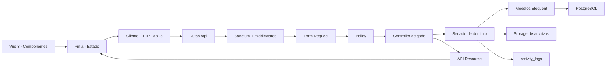

# Manual técnico de SIGAL

## 1. Propósito y límites

SIGAL centraliza procesos administrativos de la Asamblea Legislativa Departamental del Beni. El núcleo es el expediente electrónico: otros módulos aportan identidades, estructura, autoridades y permisos que el flujo documental consume.

El sistema distingue conceptos que suelen confundirse:

- Un **usuario** es una identidad de acceso.
- Un **funcionario** es una persona con kardex institucional.
- Un **contrato** registra una relación laboral y su vigencia.
- Una **membresía** indica a qué oficina pertenece un usuario durante un intervalo.
- Un **cargo** pertenece al catálogo de una oficina y puede indicar responsabilidad.
- Un **expediente** es el proceso administrativo.
- Un **documento** es una pieza que siempre pertenece a un expediente.
- Una **derivación** transfiere control administrativo; no mueve físicamente los documentos.

Estas separaciones preservan historia y permiten cambiar contratos, cargos o responsables sin reescribir actuaciones anteriores.

## 2. Vista arquitectónica

### Recorrido de una solicitud

1. Un componente Vue recoge la intención del usuario.
2. Un store Pinia coordina carga, mutación, errores y estado compartido.
3. `resources/js/lib/api.js` agrega `/api`, token Bearer y cabeceras JSON.
4. `routes/api.php` dirige la solicitud al controlador correspondiente.
5. Sanctum valida el token; `active.user` bloquea cuentas inactivas y `password.changed` impide operar con la clave temporal.
6. El Form Request normaliza y valida estructura, tipos, existencia y reglas simples.
7. El controlador consulta la Policy para autorización sobre el recurso.
8. El DTO convierte la entrada validada en un contrato tipado para el dominio.
9. El Service aplica reglas, bloqueos pesimistas y transacciones.
10. Los modelos persisten en PostgreSQL y el servicio registra auditoría.
11. Un API Resource estabiliza el JSON de salida.
12. Pinia actualiza la vista sin replicar reglas de seguridad del servidor.

## 3. Organización del repositorio

| Ruta | Responsabilidad |
|---|---|
| `app/Domain` | DTO, enums y servicios de cada dominio. |
| `app/Models` | Entidades Eloquent, relaciones, casts y scopes. |
| `app/Policies` | Autorización del lado servidor. |
| `app/Http/Controllers/Api` | Adaptación HTTP; no contiene transacciones de negocio. |
| `app/Http/Requests` | Validación y normalización de entrada. |
| `app/Http/Resources` | Contrato JSON de salida. |
| `app/Http/Middleware` | Condiciones transversales de sesión. |
| `database/migrations` | Evolución irreversible y versionada del esquema. |
| `database/seeders` | Catálogos y estructura institucional inicial. |
| `resources/js` | SPA Vue, stores, cliente API y componentes. |
| `resources/css` | Sistema visual y estilos especializados. |
| `routes` | Superficie HTTP y tareas programadas. |
| `tests` | Pruebas unitarias y de integración PostgreSQL. |
| `docker` | Imágenes y configuración de Nginx/PHP. |
| `docs` | Manuales y decisiones técnicas. |

## 4. Dominios

### 4.1 Autenticación y autorización

`AuthenticationService` inicia/cierra sesiones y cambia la contraseña propia. Laravel almacena hashes, por lo que ninguna contraseña actual puede recuperarse o mostrarse; el mecanismo administrativo correcto es generar una clave temporal, exigir su cambio y revocar tokens previos.

Roles vigentes:

- `super_administrator`: administración completa; su matriz total es inmutable.
- `human_resources_manager`: gestión del módulo de RR. HH. sin control global.
- `observer`: consulta integral de expedientes dentro de oficinas raíz seleccionadas y sus dependencias.
- `simple_user`: acceso limitado por permisos, oficina, custodia y distribución interna.

`user_role_assignments` conserva inicio y cierre. No se reemplaza el historial con una columna simple en `users`. `permissions` y `permission_role` forman una matriz configurable de vistas y acciones para los cuatro roles fijos; las Policies vuelven a limitar los datos concretos. `UserManagementService` protege además la continuidad del último superadministrador activo.

El observador recibe una o más oficinas raíz. `OfficeHierarchyService` incluye sus descendientes y la interfaz los previsualiza antes de guardar. Al retirar alcance, `observer_office_scopes` conserva la consulta histórica de expedientes vistos hasta ese momento, sin incorporar expedientes futuros. Reservados y confidenciales requieren además una concesión expresa de superadministración.

### 4.2 Auditoría

`ActivityLogger` recibe un `RequestAuditContext` construido desde la solicitud HTTP y persiste evento, actor, sujeto, valores anteriores/nuevos, IP y agente del navegador. La auditoría es evidencia institucional: no debe editarse ni eliminarse mediante funcionalidades ordinarias.

### 4.3 Legislaturas y Directiva

Una legislatura contiene años consecutivos y solo una puede estar activa. Al activar otra, el servicio inactiva la anterior en la misma transacción. PostgreSQL complementa la validación con un índice único parcial.

Las asignaciones de Directiva son intervalos históricos. Reemplazar un titular cierra el anterior exactamente cuando comienza el nuevo. Los cargos válidos están centralizados en `BoardPosition`, evitando cadenas libres distintas entre backend y frontend.

### 4.4 Organización

`offices.parent_id` construye el organigrama. `supports_staffing` separa nodos representativos de oficinas que admiten funcionarios; `requires_manager` indica si la oficina necesita un responsable. Las membresías registran usuario, oficina, función y vigencia.

La jerarquía sirve tanto para mostrar el organigrama como para resolver visibilidad, oficina remitente, tenencia de expedientes y supervisión por responsables.

### 4.5 Recursos Humanos

El alta coordinada por `HumanResourcesService` registra o reutiliza al funcionario, crea contrato, habilita la cuenta, asigna el rol Usuario simple y abre membresía. La operación es transaccional: una falla impide datos parciales. La elevación a otro rol se realiza después, exclusivamente desde Administración.

Reglas centrales:

- CI sin duplicados para identificar a una persona que pudo trabajar antes.
- Nombres y apellidos normalizados en mayúsculas.
- Toda cuenta nueva de funcionario recibe como contraseña inicial el CI completo —incluido su complemento— seguido por las iniciales ASCII en mayúsculas de todos sus nombres y apellidos; por ejemplo, `8123456MEVS` para María Elena Vargas Suárez.
- La cuenta nace con `must_change_password = true`: puede iniciar sesión, pero el middleware solo permite cambiar la contraseña o cerrar sesión hasta que registre una clave definitiva.
- Un solo contrato vigente por funcionario.
- Cargos filtrados por oficina.
- Contratos futuros activan acceso al llegar su fecha.
- Vencimiento o cierre finaliza membresía/rol contractual e inactiva acceso.
- Una nueva contratación reutiliza kardex y cuenta.
- Foto y respaldos se guardan fuera de la base con hash y metadatos.

La importación masiva tiene dos fases. `EmployeeImportWorkbookReader` interpreta el `.xlsx` sin confiar en Excel como fuente segura. `EmployeeBulkImportService` valida encabezados, catálogos, duplicados y filas; solo después registra cada fila mediante las mismas reglas utilizadas por el alta manual. La plantilla contiene listas en español y admite nombres completos de oficina.

### 4.6 Gestión documental

El alta normal se coordina mediante `DocumentedExpedientEntryService`: expediente, documento inicial, adjuntos y derivación se crean en una transacción. `ExpedientRegistrationService` conserva el caso excepcional de expediente sin documento.

`DocumentWorkflowService` crea documentos posteriores y puede derivarlos en la misma operación. Si la base revierte después de guardar archivos, elimina los binarios ya escritos para evitar residuos.

La tenencia se determina por el último movimiento, no por quién creó el expediente. Solo una oficina destinataria primaria vigente puede actuar. Las copias reciben información sin pendiente. Si `requires_response` es falso, los destinatarios se marcan finalizados automáticamente aunque conservan acceso al documento recibido.

`ExpedientMovementService`:

1. bloquea el expediente para evitar derivaciones concurrentes;
2. comprueba que la oficina remitente pertenezca al actor y tenga la tenencia actual;
3. valida destinatarios activos y sin duplicados;
4. crea movimiento y destinatarios;
5. recalcula el estado agregado del expediente;
6. registra auditoría.

Los estados por destinatario permiten que cada oficina finalice su propia participación. El estado global se deriva de la combinación del último movimiento: derivado, pendiente, en proceso, respondido parcial/completo u observado.

La llegada a una oficina se distribuye según una configuración persistente. En `manager_assignment`, la jefatura ve y controla inicialmente la llegada, designa un responsable operativo único y colaboradores de lectura; después solo el responsable puede responder o derivar, mientras la jefatura conserva lectura y reasignación. En `authorized_team`, la jefatura y el equipo seleccionado pueden operar las llegadas siguientes. Las oficinas sin responsable usan `all_members`. Cada cambio conserva intervalos históricos y aparece dentro del historial del expediente, pero no crea una derivación entre oficinas.

Los documentos tienen borrador, emisión y correcciones. Una vez emitidos no se sobrescriben. `document_revisions` conserva contenido/versiones y `document_attachments` metadatos/hash. `NumberSequenceService` usa bloqueos para reservar números sin colisiones concurrentes.

### 4.7 Reinicio operativo

`OperationalResetService` elimina información transaccional generada durante pruebas y conserva configuración base, oficinas y cargos. Está restringido al superadministrador, exige confirmación y no equivale a borrar/migrar de nuevo toda la base. Antes de usarlo en un entorno con información real se debe respaldar PostgreSQL y el volumen de archivos.

## 5. Frontend

`SigalApp.vue` es el shell autenticado: navegación modular por permisos, carga inicial y selección de workspace. La interfaz no usa un router cliente; cambia el workspace activo mediante estado local y abre el detalle de expediente como vista de trabajo completa. Restaura la sesión al recuperar foco y cada 60 segundos para reflejar cambios de rol o permiso sin recarga manual.

Los stores son fachadas del API:

- `session.js`: token, usuario, roles y permisos derivados.
- `document-management.js`: catálogos, bandejas, detalle, documentos y movimientos.
- `human-resources.js`: bootstrap, funcionarios, cargos, contratos e importación.
- `legislatures.js`: legislaturas y Directiva.

`SearchableSelect.vue` estandariza selects filtrables; `RichTextEditor.vue` encapsula edición enriquecida; el backend siempre vuelve a validar y sanear su contenido.

La bandeja documental se refresca después de cada mutación, al recuperar foco, al volver visible la pestaña y periódicamente. El middleware `no.store` marca las respuestas autenticadas para que navegador y proxy no reutilicen datos de bandeja o permisos obsoletos.

## 6. Persistencia, concurrencia y archivos

- Las migraciones son la única fuente del esquema.
- Los enums PHP reflejan valores persistidos y etiquetas de interfaz.
- Los intervalos históricos utilizan fechas de inicio/cierre; no se borran para “actualizar”.
- `DB::transaction()` agrupa cambios que deben confirmarse o revertirse juntos.
- `lockForUpdate()` serializa operaciones sensibles como numeración, activación única o cambio de tenencia.
- Los binarios viven en el disco configurado por Laravel. PostgreSQL guarda ruta opaca, nombre, MIME, tamaño y SHA-256.
- Las descargas pasan por controlador y Policy; no se debe exponer un path interno sin autorización.

## 7. Seguridad

- No confiar en botones ocultos: toda autorización se repite en Policies/servicios.
- No registrar contraseñas, tokens, archivos personales ni secretos en logs o commits.
- Las contraseñas se almacenan con hash irreversible.
- Una cuenta inactiva pierde sus tokens y el middleware bloquea solicitudes posteriores.
- La clave temporal obliga a pasar por la pantalla de cambio antes de acceder a módulos.
- Los errores de validación retornan `422`; falta de autenticación `401`; falta de autorización `403`.
- Nginx limita ejecución PHP al front controller y añade cabeceras defensivas.

## 8. Cómo extender SIGAL

Para una entidad o proceso nuevo:

1. Confirmar reglas de negocio y permisos.
2. Diseñar tabla, claves, índices e historia.
3. Crear migración y modelo con relaciones/casts.
4. Definir enum y DTO cuando exista vocabulario o entrada estructurada.
5. Crear Form Request y Policy.
6. Implementar Service transaccional y auditoría.
7. Mantener Controller delgado y salida mediante Resource.
8. Registrar rutas protegidas.
9. Añadir store/componentes Vue sin duplicar seguridad.
10. Cubrir invariantes y concurrencia con pruebas.
11. Actualizar estos manuales.

## 9. Diagnóstico rápido

- `401`: revisar token y sesión.
- `403`: revisar permiso efectivo, Policy, membresía vigente, alcance/confidencialidad y asignación interna.
- `422`: leer `errors` de la respuesta; no reemplazar la validación con mensajes genéricos.
- Bandeja vacía: confirmar contrato/membresía, destinatario del último movimiento y filtro de pendientes/finalizados.
- Numeración inesperada: revisar legislatura activa y secuencia de oficina.
- Contrato no activado/vencido: revisar scheduler y zona `America/La_Paz`.
- Archivo no visible: revisar volumen `storage`, permisos y metadatos del adjunto.
- Frontend antiguo: recompilar Vite; las respuestas funcionales ya usan `no-store`, pero los assets versionados pueden requerir publicar el nuevo `public/build` y recargar una vez.

Los procedimientos completos están en [operations/soporte.md](operations/soporte.md).
